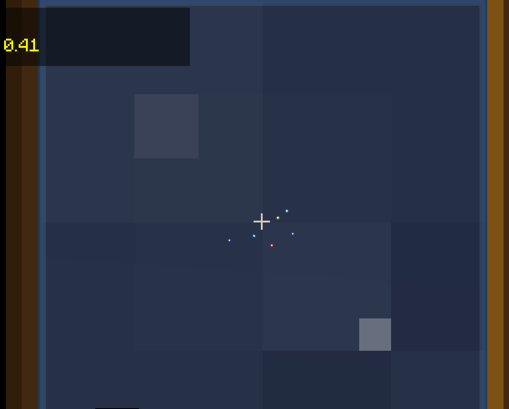

简介 Introduction\
Mod for NeoForge Minecraft 1.21.1
=======

# 星星，行星和恒星系。
这个 Mod 添加了对太阳系运转的模拟，月亮和太阳现在不再永不见面了！现在它们的位置将遵从开普勒公式，并隔一段时间重新计算。

# 内容
歪斜的行星？现在的地球可以有一个倾斜的自转轴，这会改变该星球上观测者的视野。\
遥远的星星！在天球上的天体，因为过于遥远，所以在绝对坐标系中是“静止”的。\
添加了道具“天文手稿”（Astronomical Manuscript），你可以通过它找到行星们的位置。\
望远镜升级！你可以看到星星的信息了。\
添加了流星效果，在天幕中的发生概率为0.06。

# 设置和自定义
现在是基于数据包和资源包驱动的。\
如何修改星系结构：在数据包中/data/readstar/custom/planets/system.json中写入你自定义的星系树。\
例如默认的星系树：

```javascript
{
  "Sun": {
    "Earth": {
      "Moon": {}
    },
    "Mars": {}
  }
}
```
这构建了一个Sun星系，有Earth，Mars两颗行星，其中Earth有一个Moon卫星。该json设置对大小写不敏感。\
同时在和system.json同一级的文件夹中，要包含所有行星的具体数据，以Sun为例：\
```javascript

{
  "mass": 2e30,
  "radius": 6.955e8,
  "axis": [0.0, 0.0, 0.0],
  "a": 0.0,
  "e": 0.0,
  "i": 0.0,
  "w": 0.0,
  "o": 0.0,
  "M0": 0.0
}
```
其中a为轨道半长轴，e为轨道离心率，i 是轨道倾角，w 是近心点俯角， o 是升交点经度。\
axis是行星自转轴指向，若axis长度为0，则认为axis=[0, 1, 0]。\
如何修改星星内容：在资源包中/assets/readstar/custom/stars/stars.json中写入你自定义的星星，该文件的结构为：
```javascript
{
  "Stars": [
    
  ]
}
```
其中Stars是一个列表，每一个星星的格式例如：
```javascript
{
  "name": "Sirius",
  "position": [
    -0.18745523,
    0.9392175288,
    -0.2876299192
  ],
  "type": 1,
  "Vmag": -1.44
}
```
其中position是星星的方向矢量，若长度不为1则缩放为1；type是星星的贴图种类，Vmag是视星等。\
一个正确的stars.json文件例如：
```javascript
{
  "Stars": [
    {
      "name": "Sirius",
      "position": [
        -0.18745523,
        0.9392175288,
        -0.2876299192
      ],
      "type": 1,
      "Vmag": -1.44
    },
    {
      "name": "Canopus",
      "position": [
        -0.0632226532,
        0.6027419504,
        -0.7954275815
      ],
      "type": 8,
      "Vmag": -0.62
    },
    {
      "name": "Arcturus",
      "position": [
        -0.7837870542,
        -0.5269869065,
        0.3285767094
      ],
      "type": 5,
      "Vmag": -0.05
    }
  ]
}
```
行星和星星的贴图保存在资源包 /assets/readstar/textures/environment/ 下， 
向其中加入行星贴图以适配自定义的星系结构，注意行星（非星系中央天体）需要的贴图类似原版月亮贴图：\
\
而中央天体则类似太阳贴图。\
为了修改星星贴图，需要修改该目录下的stars.png和starlight.png，代表了主题颜色和高视星等下的眩光效果，它们默认长这样：\

\
可以修改这两个文件为任意想要的内容，只要把对应位置的贴图替换，注意每个款式包括了32*32像素。

欢迎交流：QQ 1210136901。

# 画廊


